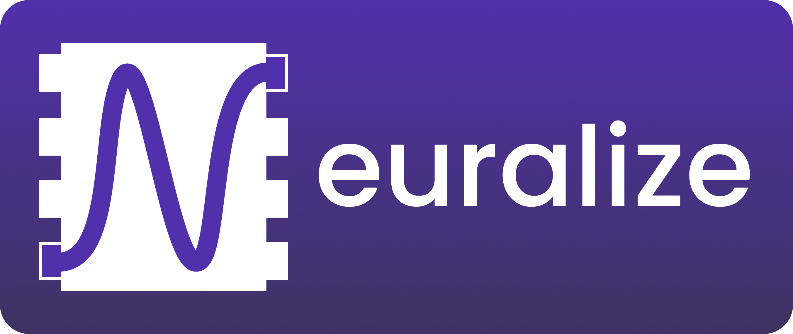

<h1 align="center">
    
      
    Edgerunner
</h1>

<h4 align="center">
    Universal AI inference library for mobile devices.
</h4>

    <a href="https://runlocal.ai">Website</a> |
    <a href="https://runlocal.ai#contact">Contact</a> |
    <a href="https://discord.gg/y9EzZEkwbR">Discord</a> |
    <a href="https://x.com/Neuralize_AI">Twitter</a> |
    <a href="https://neuralize-ai.github.io/edgerunner">Docs</a>
      
    
    

## 💡 Introduction

The purpose of Edgerunner is to facilitate quick and easy integration of
arbitrary AI models that are targeted for consumer mobile devices
(smartphones, laptops, tablets, wearables, etc.).

Currently, on-device inference tooling is highly fragmented. To run AI models
efficiently on end-user devices, developers require a deep understanding of
every chip/device platform (Apple, Qualcomm, MediaTek, etc.) and on-device AI
frameworks (
[TFLite](https://ai.google.dev/edge/lite),
[CoreML](https://developer.apple.com/documentation/coreml),
[QNN](https://www.qualcomm.com/developer/software/neural-processing-sdk-for-ai),
etc.).
Developers also need to maintain entirely separate ML stacks for iOS and
Android, increasing the effort required to support and maintain their
cross-platform systems.

Edgerunner aims to consolidate existing on-device AI frameworks, abstracting
cross-platform on-device AI complexities. This will be achieved through a
runtime-agnostic API, which can load and interact with arbitrary instances of
on-device AI models with just a few lines of code.

This repo is in its early stages of development (see [Features](#-features) and
[Support](#-support)). The local inference space is quickly evolving and, as
such, the goals of this project are subject to change.
There is lots of work to be done in order to achieve our vision, and your
[contributions](#-contributing) will be important to make this happen!

   󰀲 Kotlin bindings for Android can be found at [edgerunner-android](https://github.com/neuralize-ai/edgerunner-android).

### What makes Edgerunner unique?

Good question! Indeed there are other cross-platform libraries such as
[TFLite](link), and [ONNX](link), [ExecuTorch](link). Edgerunner will differentiate with:

- Shared libraries for platform specific SDKs are managed internally.
- Quicker and easier setup with sane defaults and no boilerplate code.
- Compatibility with any model format (`.tflite`, `.onnx`, `.pte`, etc).
- Easier configuration of delegates (`CPU`, `GPU`, `NPU`), applying desired
hardware acceleration with a single API call.
- No manual memory allocation required (model input and output tensors are
pre-allocated and accessed leading to copy-free inference).

## 🎁 Features

|           Feature                   | Status |
| ------------------------------------|:------:|
| Runtime-agnostic API                |   ✅   |
| Model loading                       |   ✅   |
| Model execution                     |   ✅   |
| Automatic framework detection       |   ✅   |
| Quantized models                    |   ⏳   |
| Choose optimal execution at runtime |   ⏳   |
| Java bindings                       |   ⏳   |
| Objective-C bindings                |   ⏳   |

Please request additional features through Github issues or on our [Discord](https://discord.gg/y9EzZEkwbR).

## 🔌 Support

### OS

| Linux | MacOS | Windows | Android | iOS |
|:-----:|:-----:|:-------:|:-------:|:---:|
|  ✅   |  ✅   |   ⏳    |   ✅    | ⏳  |

### Runtime Framework

| TFLite | CoreML | Onnx | QNN | OpenVino | Ryzen AI | NeuroPilot |
|:------:|:------:|:----:|:---:|:--------:|:--------:|:----------:|
|   ✅   |   ⏳   |  ⏳  | ⏳  |    ⏳    |    ⏳    |     ⏳     |

### Chip Vendor

|     | Apple | Qualcomm | MediaTek | Samsung | Intel | AMD | NVIDIA |
|:---:|:-----:|:--------:|:--------:|:-------:|:-----:|:---:|:------:|
| CPU |  ✅   |    ✅    |    ✅    |   ✅    |  ✅   | ✅  |   ⛔️   |
| GPU |  ⏳   |    ⏳    |    ⏳    |   ⏳    |  ✅   | ✅  |   ⏳   |
| NPU |  ⏳   |    ⏳    |    ⏳    |   ⛔️    |  ⏳   | ⏳  |   ⛔️   |

## 🛠 Building and installing

See the [BUILDING](BUILDING.md) document.

## 🕹 Usage

See [examples](example/README.md) for basic usage instructions.

## 🏆 Contributing

See the [CONTRIBUTING](CONTRIBUTING.md) document.

Join our [Discord](https://discord.gg/y9EzZEkwbR) for discussing any issues.

## 📜 Licensing

See the [LICENSING](LICENSE.txt) document.
